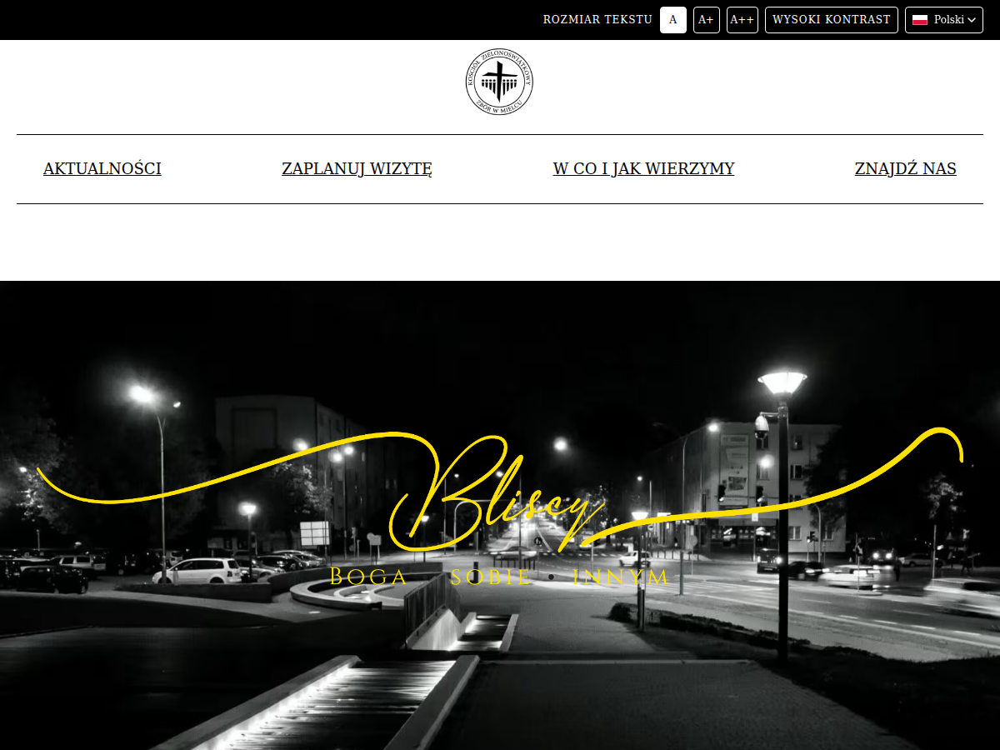

# Pentecostal Church in Mielec — WordPress

Website for [kzmielec.pl](https://kzmielec.pl), in Polish, English, Ukrainian and
Spanish. Migration from a hardcoded HTML5 Blank theme, where every page lived in
PHP, to a Gutenberg architecture where the same design is editable from the admin.

The design is deliberately unchanged: Cinzel display font, black-and-white
palette, anchored one-page scrolling. All existing URLs are preserved for SEO.



## In numbers

The repository holds the whole WordPress install, so it is worth saying which part
is written here: **234 files, about 27 400 lines** — 107 PHP, 58 SCSS, 40 JS, 8 TS —
in one theme and four plugins.

| | |
|---|---|
| languages | 4 (`pl` at the root, `en`, `uk`, `es`), live since 2026-08-13 |
| translated content | 18 pages and 37 comparison topics per language, 174 posts in all |
| own Gutenberg blocks | 11, of which 10 render server-side |
| accessibility | **0 violations of WCAG 2.1 AA**, axe in a real browser, 36 scans (12 pages x 3 viewports) |
| static analysis | **PHPStan level 8** in the theme and three plugins, plus WordPress Coding Standards |
| tests | 9 PHP behaviour checks, 3 checks reading built CSS, 137 content facts in a diffable fingerprint |
| search results | 84 hand-written meta descriptions; longest title cut from 117 to 76 characters; 12 valid `Event` nodes per language |
| third-party weight removed | ~350 KB of Facebook JavaScript, and the cookies it set, replaced by a server-side feed |

Numbers with a story behind them are explained where they belong — the accessibility
strip and the SEO gaps in the theme's README, the feed and the schedule in
`custom-block-package`.

## Architecture

One classic theme plus four plugins. The split is not incidental — it decides
what survives a theme change. Every package documents itself:

| package | responsibility | |
|---|---|---|
| `themes/kzmielec` | presentation, design tokens, and the cross-cutting concerns that must outlive any plugin: languages, contact data, accessibility, SEO | [README](wp-content/themes/kzmielec/README.md) |
| `plugins/custom-posts` | CPT `meetings`, with a translated archive slug per language | [README](wp-content/plugins/custom-posts/README.md) |
| `plugins/custom-block-package` | 11 Gutenberg blocks, the Facebook feed, and the meeting schedule every other package reads | [README](wp-content/plugins/custom-block-package/README.md) |
| `plugins/comparison-of-religions` | CPT `comparison_topic` + the accordion block | [README](wp-content/plugins/comparison-of-religions/README.md) |
| `plugins/kzmielec-translate` | migration tool: fills translations via DeepL, then can be deleted | [README](wp-content/plugins/kzmielec-translate/README.md) |

**Why content types and blocks live in plugins, not the theme.** A CPT
registered by a theme becomes invisible the moment the theme is switched — the
rows stay in `wp_posts` but nothing declares the type any more. The same applies
to blocks: 10 of the 11 render server-side from a `render.php` inside the plugin,
so their markup does not depend on theme code.

**One known coupling, accepted on purpose.** `archive-meetings.php:15` imports
`CustomBlockPackage\Admin\MeetingMeta`, so deactivating that plugin while the
theme is active fatals on the meetings archive. The scenario that matters — a
theme swap — leaves plugins active, and in the reverse case those blocks would
not render anyway. Documented rather than papered over.

**The repository holds the whole install** — WordPress core, the four
third-party plugins (Polylang, Yoast SEO, LiteSpeed Cache, Instagram Feed) and
all built assets — so `git clone` yields a site that runs. Three things are
deliberately outside it; see [Deploying](#deploying).

## Languages

Four languages managed by **Polylang 3.8.6 (free)**: 18 published pages and 37
comparison topics per language, one translation group each.

| | Polish | English | Ukrainian | Spanish |
|---|---|---|---|---|
| locale | `pl_PL` | `en_GB` | `uk` | `es_ES` |
| meetings archive | `zaplanuj-wizyte` | `plan-your-visit` | `zaplanuyte-vizyt` | `planifica-tu-visita` |

Four pieces make this work, each documented where it lives:

| piece | where |
|---|---|
| 42 interface strings, overridable from the admin | theme, `Core/StringTranslations.php` |
| language switcher, no JavaScript required | theme, `Core/LanguageFlags.php` |
| reciprocal `hreflang` — Yoast does not emit it for Polylang free | theme, `Seo/Hreflang.php` |
| translated archive slug, which is a paid Polylang feature | [`custom-posts`](wp-content/plugins/custom-posts/README.md) |

**Blocks that fetch content must narrow it to the language of the post being
rendered, not the request.** On the front end Polylang narrows the query itself,
so the defect is invisible there; the editor renders blocks through a REST route
with no language context and received all four languages at once. Any cache key
covering such content needs the language in it for the same reason.

### Surviving Polylang being switched off

`Core/TranslationGuard.php` in the theme is a safety net for one specific
accident. Without Polylang the site does not break — every Polish URL still
returns 200. What happens is subtler and worse: the 174 translated posts stop
being translations and become ordinary pages of the Polish site. Measured with
Polylang off, the page sitemap went from 18 entries to 72, with no `hreflang` to
explain it to Google.

The guard lives in the **theme**, not in `kzmielec-translate` where it started.
That plugin is a migration tool; while the guard was inside it, the plugin could
never be switched off, which is a strange requirement for a tool whose job is
finished.

## Content from one source

Three things editors used to keep in four separate copies now have one home:

- **Contact details** — address, phone, tax number, e-mail and bank account come
  from one option, edited on one screen, and reach the four language versions,
  the map block, the JSON-LD graph and the SEO description through a core Block
  Bindings source. This replaced five copies that had already drifted: every
  visible e-mail address pointed at a dead development domain.
- **Belief page selection** — one setting, made once in Polish, resolved to the
  right translation at render time by the tiles block. Asked without a named
  language, `pll_get_post()` answers in the language of the request, which the
  editor's rendering route does not have.
- **The day and hour of a meeting** — a structured pair on the Polish post, from
  which the archive text, the tile text, the search index and the dates in the
  schema graph are all derived. The four prose copies had drifted into four
  incompatible shapes (`Niedziela 10:30`, `Sunday 10.30 am`, `Viernes las 18:00`),
  which is why Google could not read a date out of any of them.

Contact data is a theme feature, documented in
[the theme's README](wp-content/themes/kzmielec/README.md); the tile resolution and
the schedule live in
[`custom-block-package`](wp-content/plugins/custom-block-package/README.md).

**The pattern is the same all three times, and so is the trap.** The value has one
owner, the Polish post or one option, and every other language resolves to it at
render time. What makes it worth doing is not tidiness: it is that a drifted copy
renders perfectly. Every visible e-mail address on this site pointed at a dead
development domain for months, and the page looked right the whole time.

## Structured data

Yoast builds the schema graph; the theme fills what Yoast cannot know. Meetings
become `Event` nodes with real dates — 12 per language — so the congregation can
appear in Google's event results, and the address is written out inside each event
rather than referenced, because a reference is silently invalid there. Details and
the two mistakes worth not repeating are in
[the theme's README](wp-content/themes/kzmielec/README.md#meetings-as-event-nodes).

**No markup puts an address under a search result.** That box comes from a Google
Business Profile, which is claimed outside the site. Worth knowing before anyone
spends a day on it in code.

## Build

Each package builds independently, because each must be installable on its own.
All use `@wordpress/scripts` with a thin `webpack.config.js` on top. The theme
outputs to `assets/`, the plugins to `build/` — where
`register_block_type_from_metadata()` looks.

Built files are committed, so deploying needs no Node on the server. There is one
optimised file per entry: no `.min` variant and no development/production branch
in PHP.

```bash
ddev theme:build      # theme -> assets/  (what to run before committing)
ddev plugin:build     # custom-block-package + comparison-of-religions
ddev build:all        # all three, stopping at the first failure
ddev theme:watch      # same file names, unminified output
ddev watch:all        # theme + both block plugins in parallel
```

Run one watch at a time: `watch` while iterating, `build` to release.
`custom-posts` has no build — its `src/` is runtime code, not sources to compile.

> **WSL2 caveat.** Native inotify events do not cross the Docker bind mount, so
> watch mode misses host-side edits. `ddev theme:build` is the reliable path.

`.githooks/pre-commit` does two things: it rebuilds and re-stages the theme's
`assets/` whenever theme sources are staged, so the repository cannot receive a
development-mode bundle; and it refuses any commit containing a host name, login
or path from the deployment environment. The patterns it looks for are read from
a file outside the repository — this repository is public.

## Design system

Every value used more than once is declared once, in three scales — type,
spacing/colour, breakpoints — read at call sites through functions that reject a
step that does not exist, so a typo fails the build. All lengths are in `rem` at
a 16px root; colours are named by role, which is what makes the accessibility
strip's contrast mode a token swap rather than a stylesheet override.

Each plugin carries its own mirror of the scale, because a plugin builds
separately and must work under any theme. Details in
[the theme's README](wp-content/themes/kzmielec/README.md).

## Quality gates

| tool | scope | command |
|---|---|---|
| Biome | JS / TS / JSON | `npm run lint:js` (repo root, all packages) |
| stylelint | SCSS | `npm run lint:css` (per package) |
| PHPCS | WordPress coding standard | `composer phpcs` (per package) |
| PHPStan | PHP static analysis, **level 8** | `composer phpstan` (per package) |

**PHPStan level 8 is green in all four packages.** PHPCS is clean in `custom-posts`
and `comparison-of-religions`; the theme reports two warnings, deliberate, for the
direct SQL in `TranslationGuard`. One file is not clean and it is better named than
implied: `custom-block-package/src/blocks/custom-svg/render.php` reports **7 errors** —
two are comment punctuation, and five are `EscapeOutput` on values that were escaped
one statement earlier, or on SVG that has been through the sanitiser and cannot be
escaped again without destroying it. Both kinds are real work: the escaping belongs at
the point of output, or the exception belongs in an annotated `phpcs:ignore` that says
why. Silence in this table would have been the third option, and the wrong one.

`composer check` runs PHPStan and PHPCS together; `npx tsc --noEmit` type-checks the
theme. TypeScript is theme-only, the plugins are plain JavaScript.

Three project checks cover what no linter can see, all reading only build output:

- `check:type-scale` — a scale function that survived into built CSS. Sass passes
  an unknown function through as plain CSS, so a missing import ships broken.
- `check:mirrors` — drift between the mirrored scale files, the breakpoints, the
  `theme.json` sizes and the content width.
- `check:sizes` — a `font-size` that is not a step of the scale. stylelint
  validates syntax, not vocabulary.

## Testing

```bash
bash scripts/tests/run-all.sh    # from the host: the runner drives `ddev wp` itself
```

Nine PHP checks covering what the linters cannot: that blocks narrow their
queries to the language of the rendered post, that contact data resolves from the
shared source in all four languages, that the meeting schedule refuses an
impossible hour and only ever yields future dates in ascending order, that
Scripture quotations are published translations rather than machine paraphrases,
and that the content carries no traces of two data-mangling bugs this project has
already hit.

One of them asserts a negative on purpose: `kzt-meta.php` fails if the generated
day-and-hour field is ever *translated* again. Putting it back on the translator's
list would look like a fix and would quietly restore the drift.

`scripts/tests/fingerprint.php` prints 137 facts in a fixed order, with no post
ids, so the content state before and after a migration can be compared with a
plain `diff`.

## Local environment

DDEV on WSL2. `ddev start`, then the site is at
[kzmielec.ddev.site](https://kzmielec.ddev.site).

The custom commands live in `.ddev/commands/web/` and **are in the repository** —
`.gitignore` excludes the rest of `.ddev/` but re-includes `commands/`, because a
build script that is not in version control cannot be reviewed and cannot be fixed
once. They used to be ignored, so `ddev build:all` existed only on whichever
machine had typed it in. To add one, drop an executable file there with a
`## Description:` header; DDEV picks it up by itself.

## Deploying

Three things are **not** in the repository and must be handled separately:

1. **`vendor/` — in four packages, not one.** The theme's `functions.php` requires
   `vendor/autoload.php` and depends on `enshrined/svg-sanitize` at runtime; so do
   the `bootstrap.php` files of `custom-posts`, `custom-block-package` and
   `comparison-of-religions`. Without it the site fatals. Run
   `composer install --no-dev --optimize-autoloader` in each on the server, or rsync
   four `--no-dev` vendor trees. Doing the theme alone is a mistake that has already
   been made here: the theme loads, and the plugins take the site down with it.
2. **`wp-content/uploads/`** — media, transferred separately. Also why the AVIF
   and WebP siblings the theme serves need their own run there; see the theme's
   README.
3. **`wp-config.php`** — stays server-side, never overwritten. The DeepL API key
   for `kzmielec-translate` is added there by hand and never committed.

Everything else, including WordPress core and all built assets, comes from git.

Two things to know about the four-language site. **Polylang must stay active** —
`TranslationGuard` keeps the translations out of the sitemaps when it is not, but
that is a safety net, not a supported state. And the language-prefixed rewrite
rules are gated on Polylang, so `delete_option('rewrite_rules')` is needed after
activating or deactivating it.

## Further reading

`.claude/PROJECT-NOTES.md` — working notes rather than published documentation:
the current state, the decisions that still hold, and the traps that cost time to
find. Everything else documents itself in the package that owns it; the five
READMEs are linked from [Architecture](#architecture).

## License

The code written here — the theme and the four plugins — is **GPL-2.0-or-later**,
declared in `style.css` and in every plugin header, which is what WordPress requires
of a derivative work. The full text is `license.txt` at the root of this repository:
it is WordPress core's own copy, and there is deliberately no second one beside it.

WordPress core and the four third-party plugins carry their own licenses, unchanged.

**The content is not covered by that license.** The texts, the photographs and the
congregation's marks belong to the Pentecostal Church in Mielec, are here because the
repository holds a working install, and are not offered for reuse.
